# OpenVPN ашиглан хяналттай шалгалтын WEB орчин байгуулах лаборатори

## Даалгаврын зорилго

Энэхүү лабораторийн зорилго нь OpenVPN ашиглан дараах нөхцөлийг хангах **хяналттай VPN орчин** байгуулах юм.

- OpenVPN-д холбогдсон хэрэглэгч ердийн интернет (Google, YouTube гэх мэт) рүү **шууд хандах боломжгүй** байх
- Хэрэглэгч **зөвхөн Ubuntu Server дээр байрлах шалгалтын web систем** рүү VPN-ээр дамжин нэвтрэх
- Хэрэв хэрэглэгч OpenVPN client тохиргоог дур мэдэн өөрчилж интернет гаргах оролдлого хийвэл:
  - OpenVPN лог
  - Web серверийн лог
  - Client-side JavaScript (server-ээс илгээж буй сигнал)
  
  ашиглан **илрүүлэх архитектурын ойлголттой болох**

---

## Онолын гол ойлголтууд

- **PKI (Public Key Infrastructure)** – CA, сервер, клиент сертификатын итгэлцлийн гинжин хэлхээ
- **TLS-д суурилсан VPN** – TLS handshake ашиглан шифрлэгдсэн туннель үүсгэх
- **Routing & redirect-gateway** – Client-ийн траффикийг сервер талаас удирдах
- **tls-auth / tls-crypt** – Control channel-ийг нэмэлт HMAC key-ээр хамгаалах

---

## 1. Урьдчилсан нөхцөл

- Ubuntu Server
- Linux эсвэл Windows client PC
- Сервер дээр `root` эсвэл `sudo` эрх

---

## 2. Ашигласан орчин

| Төрөл | Тайлбар |
|-----|--------|
| VPN Server | Ubuntu Server |
| VPN Client | Ubuntu Desktop |
| VPN Software | OpenVPN |
| VPN Subnet | 10.8.0.0/24 |
| Server LAN IP | 192.168.1.11 |
| Client LAN IP | 192.168.1.10 |

OpenVPN сервер суулгах

### 2.1 Пакет суулгах, OpenVPN сервер суулгах

```bash
apt update
apt install openvpn easy-rsa -y
```

---
### 2.2 Easy-RSA хавтас бэлдэх

```bash
make-cadir /etc/openvpn/easy-rsa
cd /etc/openvpn/easy-rsa
```
---


### 2.3 CA ба серверийн сертификат үүсгэх
```bash
./easyrsa init-pki
./easyrsa build-ca
```
```bash
root@ubuntuserver:/etc/openvpn/easy-rsa# ./easyrsa build-ca
Using Easy-RSA 'vars' configuration:
* /etc/openvpn/easy-rsa/vars

Using SSL:
* openssl OpenSSL 3.0.13 30 Jan 2024 (Library: OpenSSL 3.0.13 30 Jan 2024)

Enter New CA Key Passphrase: 

Confirm New CA Key Passphrase: 
..+++++++++++++++++++++++++++++++++
You are about to be asked to enter information that will be incorporated
into your certificate request.
What you are about to enter is what is called a Distinguished Name or a DN.
There are quite a few fields but you can leave some blank
For some fields there will be a default value,
If you enter '.', the field will be left blank.
-----
Common Name (eg: your user, host, or server name) [Easy-RSA CA]:ubuntu

Notice
------
CA creation complete. Your new CA certificate is at:
* /etc/openvpn/easy-rsa/pki/ca.crt
```
- Энэ команд `/etc/openvpn/easy-rsa/pki/` гэсэн PKI бүтэц үүсгэдэг.
- PKI нь:
    - `pki/ca.crt` – CA‑ийн public сертификат
    - `pki/private/ca.key` – CA‑ийн private key
    - `pki/issued/` – гарын үсэг зурсан server/client сертификатууд
    - `pki/reqs/` – certificate request файлууд
    - `pki/dh.pem` – Diffie‑Hellman параметр
        
        гэх мэт хэсгүүдтэй. Энэ бүтэц нь TLS‑д суурилсан итгэлцлийн үндэс болно.

--- 
# result
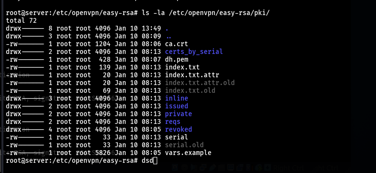

## 3. Дараа нь серверийн key/cert:
```bash
./easyrsa build-server-full server nopass
./easyrsa gen-dh
openvpn --genkey --secret ta.key
```
---

``` bash
root@ubuntuserver:/etc/openvpn/easy-rsa# ./easyrsa build-server-full server nopass
Using Easy-RSA 'vars' configuration:
* /etc/openvpn/easy-rsa/vars

Using SSL:
* openssl OpenSSL 3.0.13 30 Jan 2024 (Library: OpenSSL 3.0.13 30 Jan 2024)
.......+...+....+.....+.+.....+....+.....+............+.+......
Notice
------
Private-Key and Public-Certificate-Request files created.
Your files are:
* req: /etc/openvpn/easy-rsa/pki/reqs/server.req
* key: /etc/openvpn/easy-rsa/pki/private/server.key 

You are about to sign the following certificate:
Request subject, to be signed as a server certificate 
for '825' days:

subject=
    commonName                = server

Type the word 'yes' to continue, or any other input to abort.
  Confirm request details: yes

Using configuration from /etc/openvpn/easy-rsa/pki/openssl-easyrsa.cnf
Enter pass phrase for /etc/openvpn/easy-rsa/pki/private/ca.key:
Could not read CA private key from /etc/openvpn/easy-rsa/pki/private/ca.key
40A7590055760000:error:1608010C:STORE routines:ossl_store_handle_load_result:unsupported:../crypto/store/store_result.c:151:
40A7590055760000:error:1C800064:Provider routines:ossl_cipher_unpadblock:bad decrypt:../providers/implementations/ciphers/ciphercommon_block.c:124:
40A7590055760000:error:11800074:PKCS12 routines:PKCS12_pbe_crypt_ex:pkcs12 cipherfinal error:../crypto/pkcs12/p12_decr.c:86:empty password

Easy-RSA error:

easyrsa_openssl - Command has failed:
* openssl ca -utf8 -batch -in /etc/openvpn/easy-rsa/pki/reqs/server.req -out /etc/openvpn/easy-rsa/pki/2f10e4ee/temp.5.1 -extfile /etc/openvpn/easy-rsa/pki/2f10e4ee/temp.4.1 -days 825

EasyRSA Version Information
Version:     3.1.7
Generated:   Fri Oct 13 17:27:51 CDT 2023
SSL Lib:     OpenSSL 3.0.13 30 Jan 2024 (Library: OpenSSL 3.0.13 30 Jan 2024)
Git Commit:  3c233d279d43e419b0529411ee62bba7a08f0c0f
Source Repo: https://github.com/OpenVPN/easy-rsa
Host: 3.1.7 | nix | Linux | /bin/bash

root@ubuntuserver:/etc/openvpn/easy-rsa#

```
---

## result:
```bash
root@ubuntuserver:/etc/openvpn/easy-rsa# ls -la /etc/openvpn/easy-rsa/pki/
total 52
drwx------ 8 root root 4096 Jan  7 02:55 .
drwx------ 3 root root 4096 Jan  7 02:31 ..
-rw------- 1 root root 1184 Jan  7 02:43 ca.crt
drwx------ 2 root root 4096 Jan  7 02:33 certs_by_serial
-rw------- 1 root root    0 Jan  7 02:33 index.txt
-rw------- 1 root root   20 Jan  7 02:33 index.txt.attr
drwx------ 2 root root 4096 Jan  7 02:31 inline
drwx------ 2 root root 4096 Jan  7 02:33 issued
-rw------- 1 root root 5145 Jan  7 02:31 openssl-easyrsa.cnf
drwx------ 2 root root 4096 Jan  7 02:55 private
drwx------ 2 root root 4096 Jan  7 02:55 reqs
drwx------ 5 root root 4096 Jan  7 02:33 revoked
-rw------- 1 root root   33 Jan  7 02:52 serial
```

### 4. DH parameters үүсгэх

## Юу болдог вэ?

**DH = Diffie-Hellman parameters**

- VPN сервер болон клиент **нууц үгийг аюулгүй солилцох** үед хэрэглэгддэг математик параметрүүд
- Энэ нь **сервер ба клиент хоорондын VPN холболтыг шифрлэх үндэс**
- Хэрвээ DH үүсгэхгүй бол **VPN шифрлэлтийн холболт ажиллахгүй**

```bash
root@ubuntuserver:/etc/openvpn/easy-rsa# ./easyrsa gen-dh
Using Easy-RSA 'vars' configuration:
* /etc/openvpn/easy-rsa/vars

Using SSL:
* openssl OpenSSL 3.0.13 30 Jan 2024 (Library: OpenSSL 3.0.13 30 Jan 2024)
Generating DH parameters, 2048 bit long safe prime
...............................................................................................................................................................+.....+.......................+.......................................................................................................................................................................................................................................+..........++*++*++*++*++*++*++*++*++*++*++*++*++*++*++*++*++*++*++*++*++*++*++*++*++*++*++*++*++*++*++*++*++*++*++*++*++*++*++*++*++*++*++*++*++*++*++*++*++*++*++*++*++*++*++*++*++*++*++*++*++*++*++*++*
DH parameters appear to be ok.

Notice
------

DH parameters of size 2048 created at:
* /etc/openvpn/easy-rsa/pki/dh.pem

root@ubuntuserver:/etc/openvpn/easy-rsa# 
```

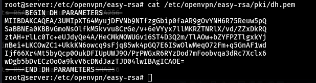


---
### Server

| file | description |
| --- | --- |
| `pki/private/server.key` |  Server private key |
| `pki/issued/server.crt` |  Server сертификат |
| `pki/ca.crt` |  CA сертификат |

### Client

| file | description |
| --- | --- |
| `pki/private/client1.key` |  Client private key |
| `pki/issued/client1.crt` |  Client сертификат  |
| `pki/inline/client1.inline` |  Client-д зориулсан inline файл үүссэн (ca.crt, client.crt, client.key, tls key бүгд нэг дор) |

###  TLS key

| file | description |
| --- | --- |
| `ta.key` |  TLS-auth / tls-crypt key бэлэн |


---


### Client config, connection командууд
client1 нэртэй client сертификат + key үүсгэж, OpenVPN client дээр ашиглах багц бэлдэж байна. nopass нь key дээр password тавихгүй гэсэн үг
- Client бүр өөрийн сертификат (`client1.crt`, `client2.crt`, etc) болон private key (`client1.key`, `client2.key`) авч, CA‑аар баталгаажуулсан байна.
- Сервер handshake үед client сертификатыг:
    - `pki/ca.crt`‑аар verify хийх,
    - CRL‑тэй (revoked жагсаалт) харьцуулан тухайн хэрэглэгч хориглогдоогүй эсэхийг шалгах.
- Энэ нь **“user‑based authentication”** болон “cert‑based access control” хийх үндэс болно.

```bash
root@ubuntuserver:/etc/openvpn/easy-rsa# ./easyrsa build-client-full client1 nopass
Using Easy-RSA 'vars' configuration:
* /etc/openvpn/easy-rsa/vars

Using SSL:
* openssl OpenSSL 3.0.13 30 Jan 2024 (Library: OpenSSL 3.0.13 30 Jan 2024)
..+....+..+................+..+.+......+...+.....+...+++++++++++++++++++++++++++++++++++++++++++++++++++++++++++++++++*...+++++++++++++++++++++++++++++++++++++++++++++++++++++++++++++++++*.........+....+.....+....+......+.....+.+.....+.........+.+..................+...+..+......+.+...........+...+...................+..+...+..........+......+..+.........+....+.....+..........+..+...+.+..............+....+..+.+...............+...+......+.....+...+..........+.....+..........+.....+.......+...........+....+.....+...................+..+.........+.............+..+....+.........+...+........+....+.....+.......+.........+..+....+.....+...............+.+........+....+......+...........+......+.......+........+.......+...+..+.............+..+...+....+.....+......+...............+...+.........+.+.................+....+........+.+..+....+..............+.+.....+....+..+...+....+..+..........+.....+.+............+...+..+...+.........+...+.......+......+.....+..........+...+...........+...+.......+...+........+...+...........................+....+...+.....+......+....+.....+.+..+...+.+...+.....................+......+...+++++++++++++++++++++++++++++++++++++++++++++++++++++++++++++++++
.+.......+......+++++++++++++++++++++++++++++++++++++++++++++++++++++++++++++++++*.+.....+...+......+....+..+.............+...+...+...........+.+..+++++++++++++++++++++++++++++++++++++++++++++++++++++++++++++++++*..+...............+............+.+.....+......................+.........+.........+..+...+......+...+...+.........+....+..+.......+...+.....+...+.+......+...+.....+......+.........+.+...+........+.......+...........+....+...............+.....................+......+......+..+......+......+..........+...+...+..+...+....+.....+.+.................+.......+..................+...+...+..+...+....+......+.....+......+...+.+.........+...+.....+...+.+.....+.+...+..+.........+....+......+........+.......+...+.................+...+.......+......+..+......+.........+............+...................+...........+....+.....+..........+......+.....+...............+.+.....+.......+..................+...+...........+.+.........+..............+.+...+...+..+.+.....................+......+..+.+..+.......+...+............+...+.....+...................+.....+.........+.+........+......+....+...........+.+......+........................+...+++++++++++++++++++++++++++++++++++++++++++++++++++++++++++++++++
-----

Notice
------
Private-Key and Public-Certificate-Request files created.
Your files are:
* req: /etc/openvpn/easy-rsa/pki/reqs/client1.req
* key: /etc/openvpn/easy-rsa/pki/private/client1.key 

You are about to sign the following certificate:
Request subject, to be signed as a client certificate 
for '825' days:

subject=
    commonName                = client1

Type the word 'yes' to continue, or any other input to abort.
  Confirm request details: yes

Using configuration from /etc/openvpn/easy-rsa/pki/openssl-easyrsa.cnf
Check that the request matches the signature
Signature ok
The Subject's Distinguished Name is as follows
commonName            :ASN.1 12:'client1'
Certificate is to be certified until Apr 11 03:48:50 2028 GMT (825 days)

Write out database with 1 new entries
Database updated

Notice
------
Certificate created at:
* /etc/openvpn/easy-rsa/pki/issued/client1.crt

Notice
------
Inline file created:
* /etc/openvpn/easy-rsa/pki/inline/client1.inline

root@ubuntuserver:/etc/openvpn/easy-rsa# 
```

---

# **OpenVPN серверийн сүлжээ, сервис ба лог**

## 1. Серверийн config (`/etc/openvpn/server.conf`)

### Гол тохиргооны блок:
### Үндсэн тохиргоо:
- port 1194        # 1194 порт дээр ажиллана (стандарт OpenVPN порт)
- proto udp        # UDP протокол ашиглана (хурдан, илүү хөнгөн)
- dev tun          # TUN device ашиглана (layer 3 VPN - IP пакет дамжуулна)
### Аюулгүй байдлын тохиргоо:
- ca /etc/openvpn/easy-rsa/pki/ca.crt                      # CA гэрчилгээний зам
- cert /etc/openvpn/easy-rsa/pki/issued/server.crt         # Серверийн гэрчилгээ
- key /etc/openvpn/easy-rsa/pki/private/server.key         # Серверийн нууц түлхүүр
- dh /etc/openvpn/easy-rsa/pki/dh.pem                      # Diffie-Hellman параметр
- tls-auth /etc/openvpn/easy-rsa/ta.key 0                  # TLS аутентикацийн түлхүүр (серверийн талд)

Тайлбар: Эдгээр файлууд нь TLS handshake-д ашиглагдаж, холболтын аюулгүй байдлыг хангана.

### VPN сүлжээний бүтэц:
- Серверийн VPN хаяг: 10.8.0.1  
- Хэрэглэгчдийн хаяг: 10.8.0.2 - 10.8.0.254
Утга: Хэрэглэгчдэд 10.8.0.1-10.8.0.254 хооронд IP хаяг онооно.

### Дэмжих тохиргоонууд:
- keepalive 10 120    # 10 секунд тутам keepalive пакет илгээнэ, 120 секунд хүлээнэ
- cipher AES-256-GCM  # AES-256-GCM шифрлэлт ашиглана (хамгийн орчин үеийн, хурдан)
- user nobody         # OpenVPN процесс nobody хэрэглэгчээр ажиллана (аюулгүй байдал)
- group nogroup       # nogroup бүлэгтэй байна
- persist-key         # Давхар ачаалах үед түлхүүрийг хадгална
- persist-tun         # TUN төхөөрөмжийг дахин эхлүүлэхэд хадгална

### Лог, мэдээллийн тохиргоо:
- status openvpn-status.log  # Холболтын статусыг энэ файлд хадгална
- verb 3                     # Логийн дэлгэрэнгүй байдал (3 - ерөнхий мэдээлэл)
- explicit-exit-notify 1     # Хэрэглэгч disconnect хийхэд серверт мэдэгдэнэ (UPT)
- mssfix 1300               # Maximum Segment Size-г 1300 болгож тохируулна

### Сүлжээний тохиргоо:
- server 10.8.0.0 255.255.255.0  # VPN сүлжээ: 10.8.0.0/24
- topology subnet                # Subnet topology ашиглана

### Чухал тайлбарууд:

- tls-auth ta.key 0 - DDoS халдлагаас хамгаалах, нэмэлт аюулгүй байдал
- AES-256-GCM - hardware acceleration дэмждэг, маш хурдан
- mssfix 1300 - VPN tunnel дотор MTU асуудлыг шийддэг
- push "route ..." мөрүүдийг comment хийсэн нь шаардлагагүй гэсэн үг


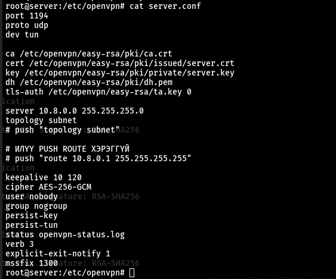

Эдгээр мөр:

    VPN асаахад: client‑д 10.8.0.2, серверт 10.8.0.1 IP‑тэй tun0 интерфейс үүсгэдэг.

    VPN салгахад: энэ tun0 interface, 10.8.0.0/24 route хоёулаа алга болно.

Тэгэхээр:

    Exam web‑ийг 10.8.0.1 дээр (Nginx) ажиллуулж байгаа тул

    tun0 байхгүй бол client‑ийн талд 10.8.0.1 рүү чиглэсэн ямар ч route үлдэхгүй → VPN салмагц exam web‑д хүрч чадахгүй.

Өөрөөр хэлбэл, “VPN байхгүй үед web server‑ийг хаах” логик нь:

    Web server‑ийг унтраах биш, харин web server луу очих IP/route‑ыг зөвхөн VPN асаалттай үед л үүсгэж байгаа.


---

### IP forward ба iptables командууд
- `echo "net.ipv4.ip_forward=1" >> /etc/sysctl.conf` (эсвэл гараар засна)
    - Linux kernel‑д IPv4 packet forwarding‑ийг зөвшөөрөх тохиргоо нэмж байна.
    VPN‑ээс ирсэн packet‑үүдийг интернет рүү дамжуулахын тулд хэрэгтэй.
- `sysctl -p`
    - `/etc/sysctl.conf` файлын тохиргоог дахин уншиж, `net.ipv4.ip_forward=1`‑ийг шууд хэрэгжүүлнэ.

`iptables -t nat -A POSTROUTING -s 10.8.0.0/24 -o eth0 -j MASQUERADE`

- NAT table‑д POSTROUTING chain дээр дүрэм нэмэж, VPN‑ийн `10.8.0.0/24` сүлжээнээс гарч буй packet‑үүдийг `eth0` интерфэйсээр гарахдаа серверийн IP болж хувиргана (маскарадинг). VPN client‑ууд интернэт рүү гарах боломж энэ дүрмээр үүснэ.

```bash
root@ubuntuserver:/etc/openvpn/easy-rsa# systemctl start openvpn@server
systemctl enable openvpn@server
systemctl status openvpn@server
● openvpn@server.service - OpenVPN connection to server
     Loaded: loaded (/usr/lib/systemd/system/openvpn@.service; enabled; preset: enabled)
     Active: active (running) since Wed 2026-01-07 03:29:54 UTC; 16min ago
       Docs: man:openvpn(8)
             https://community.openvpn.net/openvpn/wiki/Openvpn24ManPage
             https://community.openvpn.net/openvpn/wiki/HOWTO
   Main PID: 3980 (openvpn)
     Status: "Initialization Sequence Completed"
      Tasks: 1 (limit: 10)
     Memory: 1.4M (peak: 1.6M)
        CPU: 42ms
     CGroup: /system.slice/system-openvpn.slice/openvpn@server.service
             └─3980 /usr/sbin/openvpn --daemon ovpn-server --status /run/openvpn/server.status 10 --cd /etc/openvpn ->

Jan 07 03:29:54 ubuntuserver ovpn-server[3980]: net_iface_up: set tun0 up
Jan 07 03:29:54 ubuntuserver ovpn-server[3980]: net_addr_ptp_v4_add: 10.8.0.1 peer 10.8.0.2 dev tun0
Jan 07 03:29:54 ubuntuserver ovpn-server[3980]: net_route_v4_add: 10.8.0.0/24 via 10.8.0.2 dev [NULL] table 0 metric >
Jan 07 03:29:54 ubuntuserver ovpn-server[3980]: Could not determine IPv4/IPv6 protocol. Using AF_INET
Jan 07 03:29:54 ubuntuserver ovpn-server[3980]: Socket Buffers: R=[212992->212992] S=[212992->212992]
Jan 07 03:29:54 ubuntuserver ovpn-server[3980]: UDPv4 link local (bound): [AF_INET][undef]:1194
Jan 07 03:29:54 ubuntuserver ovpn-server[3980]: UDPv4 link remote: [AF_UNSPEC]
Jan 07 03:29:54 ubuntuserver ovpn-server[3980]: MULTI: multi_init called, r=256 v=256
Jan 07 03:29:54 ubuntuserver ovpn-server[3980]: IFCONFIG POOL IPv4: base=10.8.0.4 size=62
Jan 07 03:29:54 ubuntuserver ovpn-server[3980]: Initialization Sequence Completed
root@ubuntuserver:/etc/openvpn/easy-rsa# 
```


`systemctl start [email protected]`

- `server.conf`‑ийг үндэслэсэн OpenVPN серверийн системийн сервисийг асаана.

`systemctl enable [email protected]`

- Сервер асаах болгонд OpenVPN сервис автоматаар ачаалагдаж байхаар enable хийж байна.

`systemctl status [email protected]`

- OpenVPN сервисийн одоогийн төлөв (running/stopped), логийн сүүлийн мөрүүдийг харж алдаа байгаа эсэхийг шалгана.

`systemctl restart [email protected]`

- `server.conf`‑ийг зассаны дараа шинэ тохиргоо хэрэгжүүлэхийн тулд сервисийг дахин ачаалж байнa.

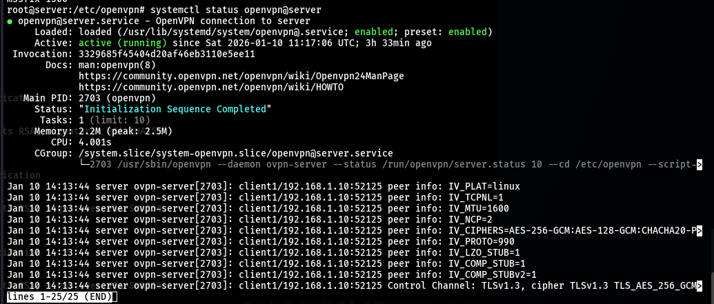


---

# systemd сервис удирдах

tun0 интерфэйс үүсэж, 10.8.0.1 IP авсан нь түүн дээр ip addr show tun0 ба ping 10.8.0.1‑ийн үр дүнгээр батлагдсан.

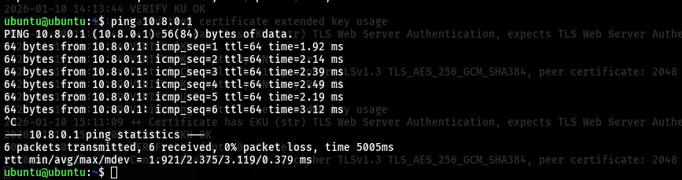


```bash
wroot@ubuntuserver:/etc/openvpn/easy-rsa# systemctl start openvpn@server
root@ubuntuserver:/etc/openvpn/easy-rsa# systemctl enable openvpn@server
root@ubuntuserver:/etc/openvpn/easy-rsa# systemctl status openvpn@server
● openvpn@server.service - OpenVPN connection to server
     Loaded: loaded (...)
     Active: active (running) since Wed 2026-01-07 03:29:54 UTC
     Status: "Initialization Sequence Completed"
...
Jan 07 03:29:54 ubuntuserver ovpn-server[3980]: net_iface_up: set tun0 up
Jan 07 03:29:54 ubuntuserver ovpn-server[3980]: net_addr_ptp_v4_add: 10.8.0.1 peer 10.8.0.2 dev tun0
Jan 07 03:29:54 ubuntuserver ovpn-server[3980]: net_route_v4_add: 10.8.0.0/24 via 10.8.0.2 dev [NULL]
Jan 07 03:29:54 ubuntuserver ovpn-server[3980]: UDPv4 link local (bound): [AF_INET][undef]:1194
Jan 07 03:29:54 ubuntuserver ovpn-server[3980]: IFCONFIG POOL IPv4: base=10.8.0.4 size=62
Jan 07 03:29:54 ubuntuserver ovpn-server[3980]: Initialization Sequence Completed
``` 

- `openvpn@server` unit нь `/etc/openvpn/server.conf`‑ийг ашиглан OpenVPN сервис ажиллуулж байна.
- `status` дээр `Initialization Sequence Completed` гарсан нь:
    - tun0 интерфэйс үүссэн,
    - 10.8.0.0/24 route нэмэгдсэн,
    - UDP 1194 порт дээр сонсож бэлэн болсныг илэрхийлнэ.
---

--- 
# 6. Web server

### Nginx 80 порт дээр зөв ажиллаж, exam web‑ийг serve хийж байна.
### OpenVPN туннель амжилттай босч, client 10.8.0.2 ↔ server 10.8.0.1 хооронд ping OK.
### Client route дээр redirect‑gateway ажиллаж, бүх default траффик тун0‑оор явж байгаа (0.0.0.0/1, 128.0.0.0/1).
### VPN асаалттай → client 10.8.0.1 (exam web) рүү ping/curl хийж чадна.
### Интернэт (8.8.8.8, google.com) нь VPN‑ээр гарах гэж оролдсон ч сервер NAT/forward хийхгүй учраас гацна.
### VPN салбал tun0 + 10.8.0.0/24 route алга болж, 10.8.0.1 рүү web/ping хийх боломжгүй болно.


---

# 7. OpenVPN Client тохиргоо
## Client config (client1.ovpn):

### client          # Энэ нь клиент тохиргоо гэдгийг заана
### dev tun         # Сервертэй ижил TUN device ашиглана
### proto udp       # UDP протокол (сервертэй таарч байх ёстой)
### remote 192.168.1.11 1194  # Холбогдох серверийн IP болон порт
### nobind          # Клиент тодорхой порт дээр bind хийхгүй (олон клиент зэрэг ажиллуулах боломжтой)
### persist-key     # Давхар ачаалах үед түлхүүр хадгална
### persist-tun     # TUN төхөөрөмж дахин эхлүүлэхэд хадгална
### cipher AES-256-GCM      # Сервертэй ижил шифрлэлт ашиглана
### remote-cert-tls server  # Зөвхөн TLS серверийн гэрчилгээтэй сервертэй холбогдоно
### key-direction 1         # tls-auth түлхүүрийн чиглэл (клиентийн талд 1 байна)

---

```bash

ubuntu@ubuntu:~$ cat client1.ovpn 
client
dev tun
proto udp
remote 192.168.1.11 1194
nobind
persist-key
persist-tun

cipher AES-256-GCM
remote-cert-tls server
key-direction 1
verb 3


<ca>
... CA CERT ...
</ca>

<cert>
... CLIENT CERT ...
</cert>

<key>
... CLIENT KEY ...
</key>

<tls-auth>
... STATIC KEY ...
</tls-auth>
```


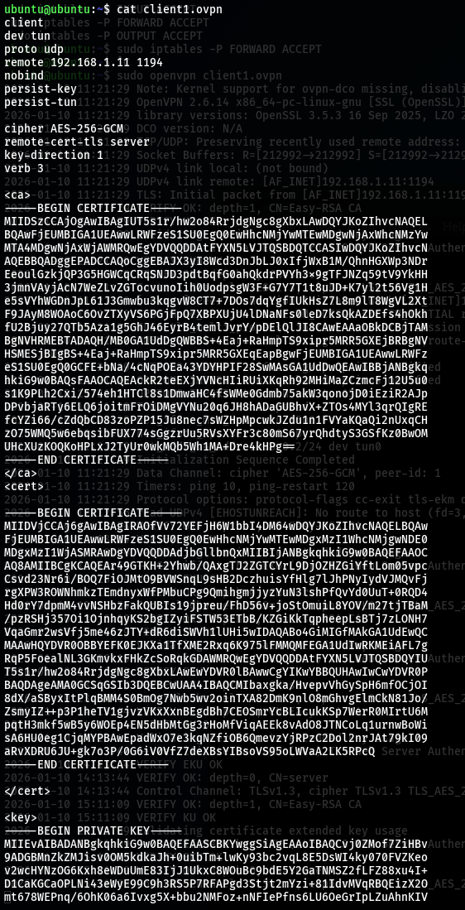

--- 

# Серверийг асаах/шалгах:

## Серверийн iptables командууд

Exam-д тааруулж ашигласан команд:

```bash
# Бүх дүрмийг цэвэрлэх
sudo iptables -F
sudo iptables -t nat -F

# Үндсэн бодлого
sudo iptables -P INPUT ACCEPT   # Орж ирэх трафик - хүлээн авах
sudo iptables -P FORWARD DROP   # Урагшлуулах трафик - хаах
sudo iptables -P OUTPUT ACCEPT  # Гарах трафик - зөвшөөрөх

# VPN (tun0) → сервер рүү
sudo iptables -A INPUT -i tun0 -p icmp -j ACCEPT    # ICMP (ping) зөвшөөрөх
sudo iptables -A INPUT -i tun0 -p tcp --dport 80 -j ACCEPT    # 2. HTTP (80 порт) зөвшөөрөх
sudo iptables -A INPUT -i tun0 -m state --state ESTABLISHED,RELATED -j ACCEPT   # 3. ESTABLISHED холболтуудыг зөвшөөрөх

# VPN-ээс LAN/интернет рүү гарахыг хориглох
sudo iptables -A FORWARD -i tun0 -j DROP

# Шалгах
sudo iptables -L -v -n            # Бүх дүрмийг харах
sudo iptables -t nat -L -v -n     # NAT дүрмийг харах
```

---

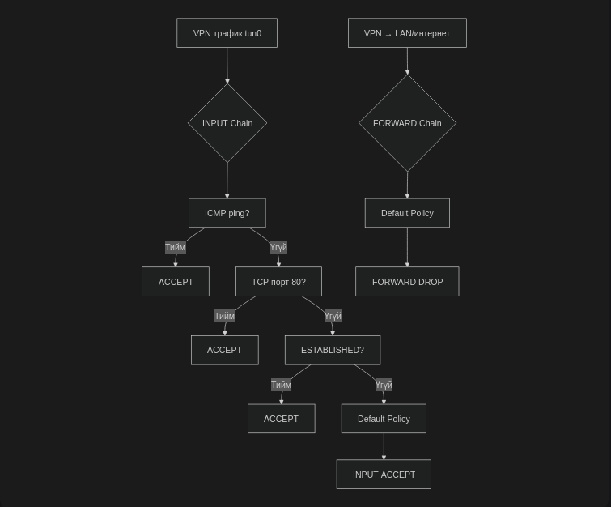

---

```bash
sudo systemctl restart openvpn@server
sudo systemctl status openvpn@server -l
journalctl -xeu openvpn@server
```
---
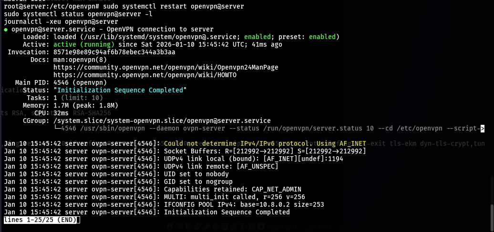
---

## VPN хэрэглэгч серверт:
- VPN хэрэглэгч → Сервер (ping): ЗӨВШӨӨРӨГДӨНӨ
- VPN хэрэглэгч → Сервер (HTTP): ЗӨВШӨӨРӨГДӨНӨ
- VPN хэрэглэгч ← Сервер (хариу): ЗӨВШӨӨРӨГДӨНӨ
---
## VPN хэрэглэгч → интернет
- VPN хэрэглэгч → Google.com: ХОРИГЛОГДОНО
- VPN хэрэглэгч → LAN бусад PC: ХОРИГЛОГДОНО

---


# Client - Server - Result:

### Client VPN IP (10.8.0.2) амжилттай авсан
### Client → Server (10.8.0.1) ping OK
### Client интернэт рүү гарч чадахгүй
### Client зөвхөн VPN серверийн web рүү хандах боломжтой
### Бүх холболт OpenVPN лог дээр бүртгэгдсэн

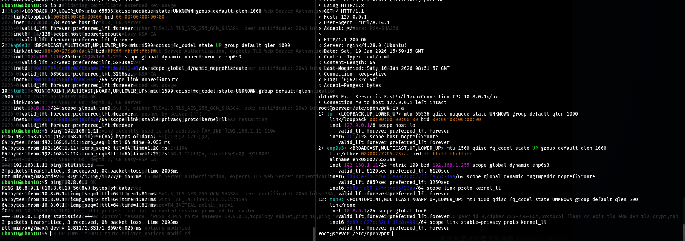

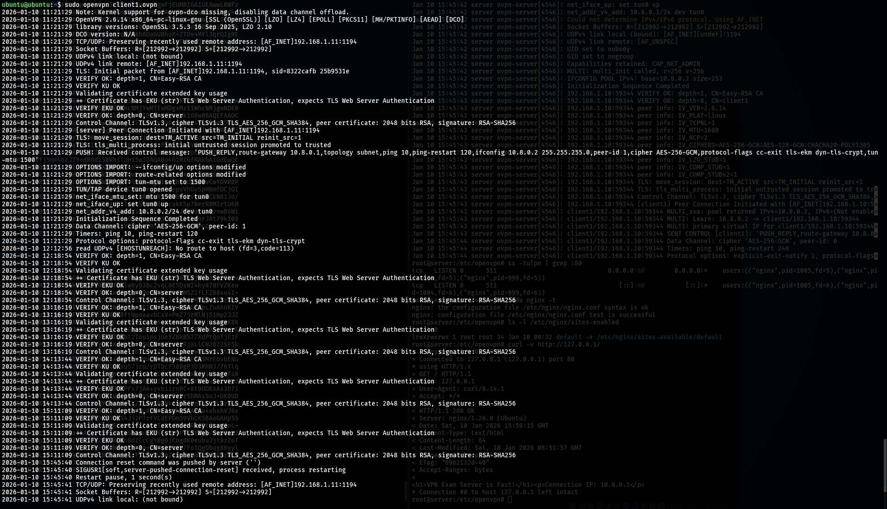


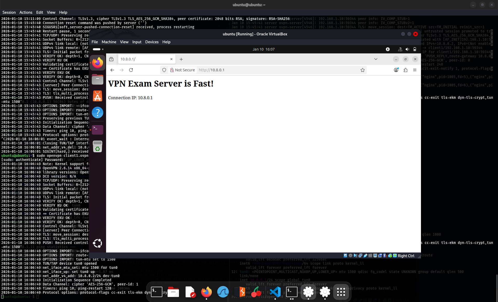
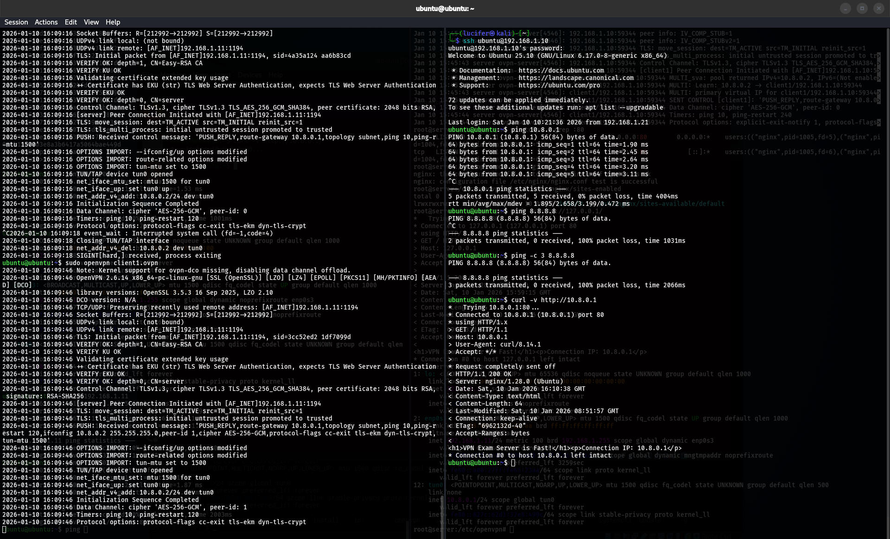

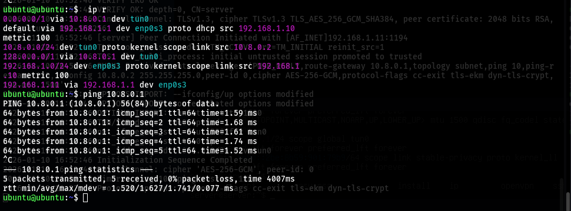---- 

# Log
## a) 

## b) Nginx access log (exam web)
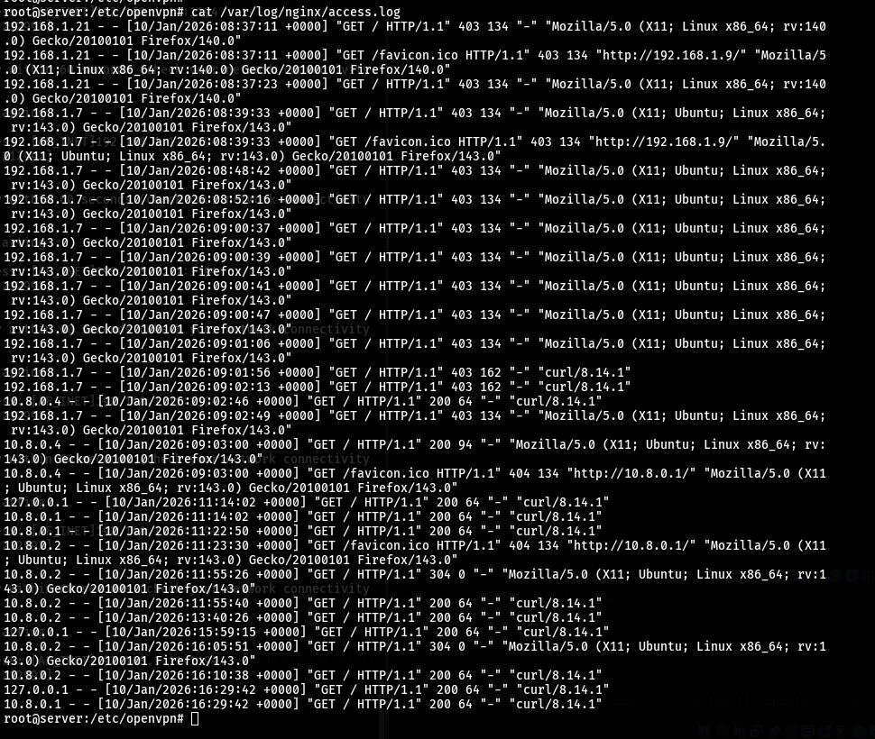
## Client config өөрчилсөн эсэхийг илрүүлэх:
### Status log дээрх траффик / хугацаа
Exam‑ын дүрэм:
Зөв config → бүх web VPN‑ээр явна → Bytes Received/Sent их, Connected Since‑ээс exam төгсөх хүртэл нэг session урт.

- Оюутан config‑ээ засч, web‑ээ VPN‑ээс гадна гаргавал:

   Exam web‑ийн багахан траффик л VPN‑ээр явна → bytes бага.
   Олон reconnect / богино session харагдана.

```bash
root@server:/etc/openvpn# cat /etc/openvpn/openvpn-status.log
OpenVPN CLIENT LIST
Updated,2026-01-10 17:12:16
Common Name,Real Address,Bytes Received,Bytes Sent,Connected Since
client1,192.168.1.10:57073,9534,9856,2026-01-10 16:54:32
ROUTING TABLE
Virtual Address,Common Name,Real Address,Last Ref
10.8.0.2,client1,192.168.1.10:57073,2026-01-10 17:02:15
GLOBAL STATS
Max bcast/mcast queue length,1
END
root@server:/etc/openvpn# 
```
Exam дууссаны дараа log‑оо хадгалаад, байт бага хэрэглэсэн IP‑г сэжиглэж болно.

---
### OpenVPN log-оор push ignore хийж байгааг анзаарах

Client config‑ээ өөрчилбөл логонд дараах шинж тэмдэг гарч болно:

  PUSH_REPLY,redirect-gateway def1,... ирж байгаа ч client route‑ууд үүсэхгүй (client log дээр net_route_v4_add 0.0.0.0/1 ... байхгүй).

  Client config‑доо route-nopull / pull-filter ignore "redirect-gateway" нэмсэн үед ийм болдог.
### Server талд:
```bash
sudo journalctl -xeu openvpn@server | grep client1
```
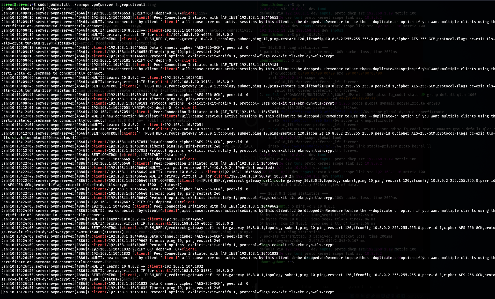

## Олон удаа reconnect хийж, секунд тутам тасалдаж байгааг хараад “config‑тэй оролдсон” гэж сэжиглэж болно.